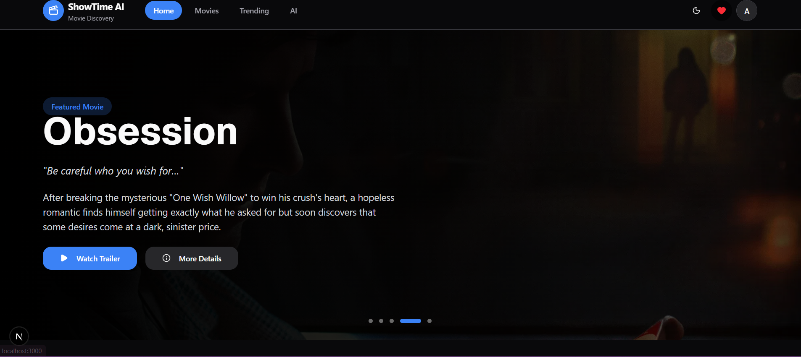
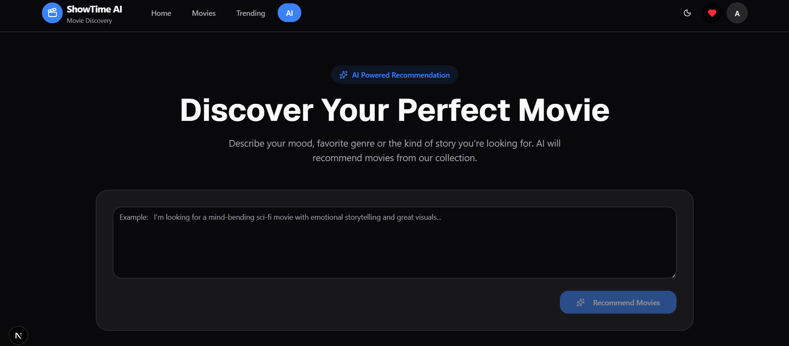
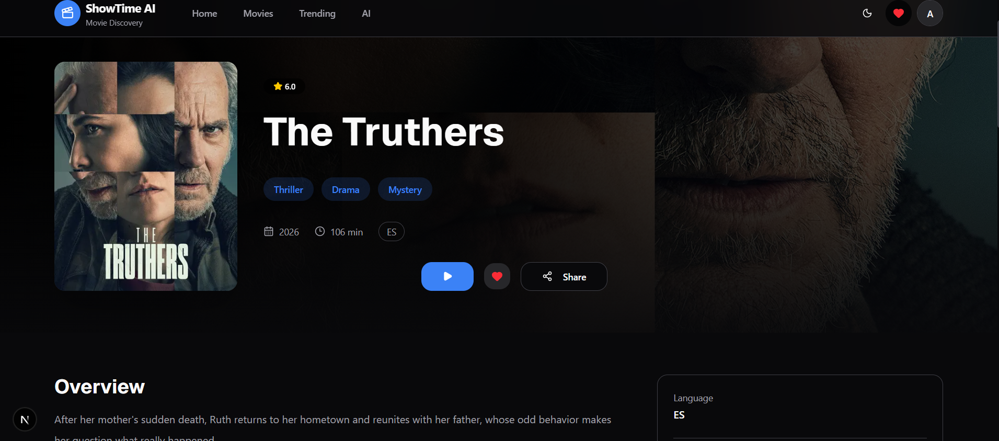
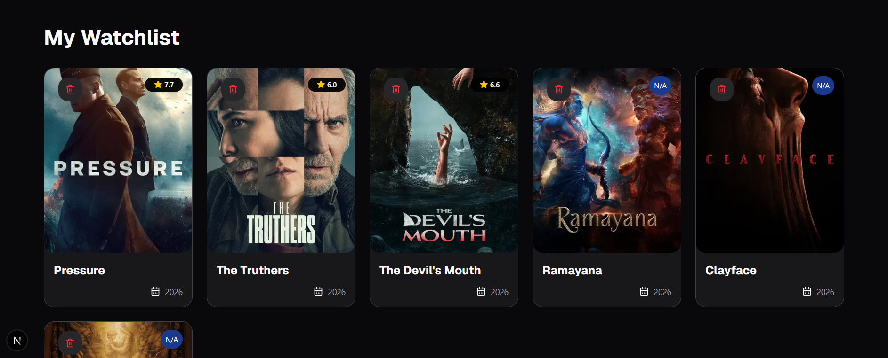
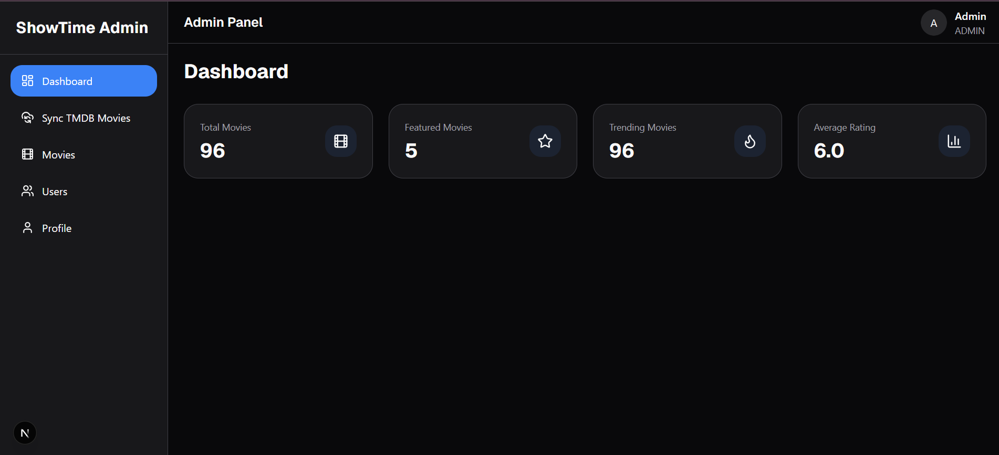

<div align="center">

# 🎬 ShowTime AI

### AI-Powered Movie Discovery Platform

Discover movies intelligently with AI-powered recommendations, personalized watchlists, trailers, and an admin dashboard powered by TMDB.

<!-- Replace these URLs -->

[Live Demo](https://showtime-ai.vercel.app) •
[Backend API](https://showtime-ai-server.onrender.com) •
[Report Bug](https://github.com/MahiaplSinghRao/showtime-ai/issues) •
[Request Feature](https://github.com/MahiaplSinghRao/showtime-ai/issues)

</div>

---

# 📖 Overview

ShowTime AI is a full-stack movie recommendation platform that combines **Artificial Intelligence**, **TMDB APIs**, and a modern web experience.

Users can explore movies, receive AI-powered recommendations using natural language, save favorites to a watchlist, and watch trailers without leaving the application.

Administrators can synchronize movies directly from TMDB, manage the movie catalog, and monitor platform statistics.

---

# ✨ Features

## 👤 User Features

- 🔐 JWT Authentication
- 🎬 Browse Movies
- 🔍 Search Movies
- 🎯 Filter Movies
- 📊 Sort Movies
- ❤️ Personal Watchlist
- 🤖 AI Movie Recommendation
- 🎥 In-App Trailer Popup
- 🌙 Dark / Light Mode
- 📱 Fully Responsive UI

---

## 🤖 AI Recommendation

Users can describe what they want in natural language.

Example:

> I want a mind-bending sci-fi movie with emotional storytelling.

The application analyzes the prompt using AI and recommends the most suitable movies.

---

## 🛠 Admin Features

- Admin Dashboard
- TMDB Movie Synchronization
- Movie Management
- User Management _(Coming Soon)_
- Platform Statistics

---

# 🖼 Screenshots

> Add screenshots after deployment.

### Home Page



---

### AI Recommendation



---

### Movie Details



---

### Watchlist



---

### Admin Dashboard



---

# 🏗 Tech Stack

## Frontend

- Next.js 15
- React
- TypeScript
- Tailwind CSS
- Shadcn UI
- Redux Toolkit
- RTK Query
- React Hook Form
- Zod
- Sonner

---


## AI

- OpenAI API
- Gemini 
- OLLAMA 

---

## External APIs

- TMDB API

---

# 📂 Project Structure

```
client/
│
├── app/
├── components/
├── features/
├── hooks/
├── lib/
├── store/
└── types/


---

# 🚀 Installation

## Clone Repository

```bash
git clone https://github.com/mahipalSinghRao/showtime_ai_client
```

---

## Client

```bash
cd client

npm install

npm run dev
```

---

## Server

```bash
cd server

npm install

npm run dev
```

---

# ⚙ Environment Variables

## Client

```
NEXT_PUBLIC_API_URL=
```

---

## Server

```
PORT=

DATABASE_URL=

JWT_SECRET=

OPENAI_API_KEY=

TMDB_API_KEY=

CLIENT_URL=
```

---

# 📡 API Endpoints

## Authentication

```
POST /auth/register

POST /auth/login

GET /auth/me
```

---

## Movies

```
GET /movies/get

GET /movies/:id

GET /movies/trending

GET /movies/featured

GET /movies/:id/similar

GET /movies/stats
```

---

## AI

```
POST /ai/recommend
```

---

## Watchlist

```
GET /watchlist

POST /watchlist

DELETE /watchlist/:movieId
```

---

## Admin

```
POST /movies/sync
```

---

# 📦 Deployment

| Service  | Platform      |
| -------- | ------------- |
| Frontend | Vercel        |
| Backend  | Render        |
| Database | MongoDB Atlas |

---

# 🎯 Upcoming Features

- Movie CRUD
- User Management
- Profile Page
- Review System
- Favorites
- Movie Analytics
- Recommendation History
- Admin Charts
- Email Verification
- Password Reset

---

# 📈 Performance

- Lazy Loading
- Image Optimization
- Server-side Rendering
- Code Splitting
- API Caching using RTK Query

---

# 🧪 Future Improvements

- Unit Testing
- Integration Testing
- Docker Support
- CI/CD Pipeline
- Redis Caching
- Elasticsearch
- Recommendation History

---

# 🤝 Contributing

Contributions are welcome.

1. Fork the repository
2. Create your feature branch

```bash
git checkout -b feature/amazing-feature
```

3. Commit changes

```bash
git commit -m "Add amazing feature"
```

4. Push

```bash
git push origin feature/amazing-feature
```

5. Open a Pull Request

---

# 👨‍💻 Author

**Mahipal Singh**

GitHub:
https://github.com/MahipalSinghRao

LinkedIn:
https://www.linkedin.com/in/mahipal-singh-barva-53a4b9b7/

Portfolio:
https://mahipalsingh.vercel.app/

---

# ⭐ Support

If you found this project useful, consider giving it a ⭐ on GitHub.

It helps others discover the project and supports future development.

---

<div align="center">

Made with ❤️ using Next.js, Express.js, MongoDB and OpenAI

</div>
